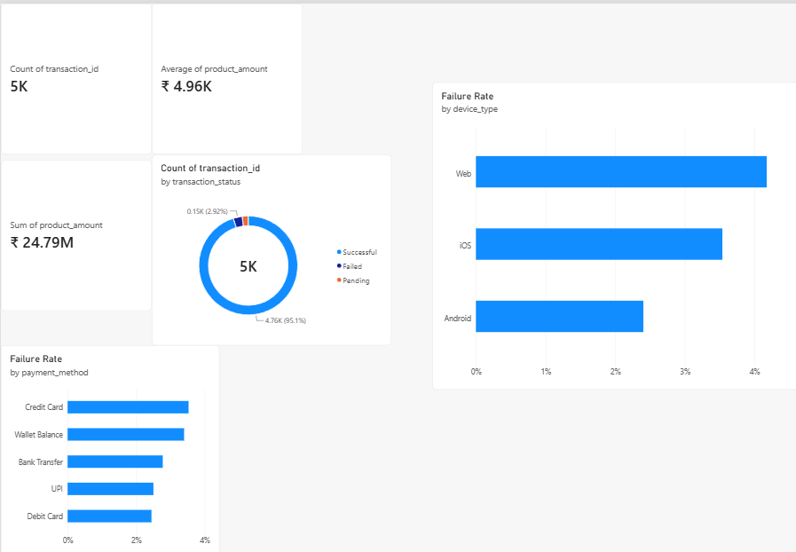
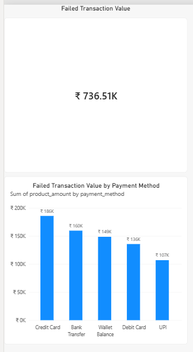

# Digital Payments Analytics

## About the Project

I built this project to practice working with SQL and Power BI using a digital payments dataset.

The goal was to look at transaction activity and understand where failed transactions were happening, especially across different payment methods and devices.

I used MySQL for the analysis and Power BI to build the dashboard.

## Questions I Wanted to Answer

- How many transactions are in the dataset?
- What is the total and average transaction value?
- How many transactions were successful, failed, or pending?
- Which payment methods have the highest failure rates?
- Do failure rates differ between devices?
- Which payment methods have the highest value of failed transactions?
- Are some product categories experiencing more failed transactions than others?

## Tools

- MySQL
- SQL
- Power BI
- DAX

## Dataset

The dataset contains **5,000 digital wallet transactions**.

It includes details such as transaction amount, payment method, transaction status, device type, product category, merchant, and location.

## What I Did

I used SQL to explore the data and calculate things like:

- Total transaction value
- Average transaction value
- Transaction count by status
- Transaction value by status
- Failure rate by payment method
- Failed transaction value by payment method
- Failure rate by device
- Failure rate by product category

I then connected the MySQL database to Power BI and used the results to build a two-page dashboard.

## Some Results

- **5,000** transactions were analyzed.
- Total transaction value was approximately **₹2.48 crore**.
- Average transaction value was approximately **₹4,958**.
- **4,755** transactions were successful.
- **146** transactions failed.
- **99** transactions were pending.
- Credit Card had the highest failure rate among the payment methods.
- Web transactions had the highest failure rate among the three device types.
- Credit Card transactions had the highest value of failed transactions.

## Power BI Dashboard

The dashboard has two pages.

### Page 1 — Transaction Overview

Shows the overall transaction volume and value, transaction status, and failure rates by payment method and device.

### Page 2 — Failure Analysis

Focuses specifically on failed transactions and compares the value of failed transactions across payment methods.

## What I Practiced

This project helped me practice:

- Writing SQL queries using `GROUP BY` and aggregate functions
- Filtering and analyzing transaction data
- Using `CASE` statements and conditional calculations
- Creating measures with DAX
- Connecting MySQL with Power BI
- Creating charts and KPI cards in Power BI
- Turning SQL analysis into a simple dashboard
